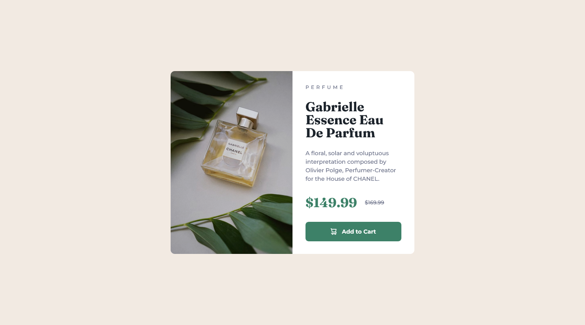

# Frontend Mentor - Product preview card component solution

This is a solution to the [Product preview card component challenge on Frontend Mentor](https://www.frontendmentor.io/challenges/product-preview-card-component-GO7UmttRfa). Frontend Mentor challenges help you improve your coding skills by building realistic projects. 

## Table of contents

- [Overview](#overview)
  - [The challenge](#the-challenge)
  - [Screenshot](#screenshot)
  - [Links](#links)
- [My process](#my-process)
  - [Built with](#built-with)
  - [What I learned](#what-i-learned)
  - [Continued development](#continued-development)
  - [Useful resources](#useful-resources)
- [Author](#author)

## Overview

### The challenge

Users should be able to:

- View the optimal layout depending on their device's screen size
- See hover and focus states for interactive elements

### Screenshot

### Links

- [Solution URL](https://github.com/loki-pepe/recipe-page)
- [Live Site UR](https://loki-pepe.github.io/product-preview-card/)

## My process

### Built with

- Semantic HTML5 markup
- CSS custom properties
- Flexbox
- Mobile-first workflow

### What I learned

I learned the basics of flexbox and got acquainted with the picture element.

I have noticed the longer time it takes for the image to adapt to the layout when switching between mobile and desktop views, but I am unsure how to fix the issue (or if it needs to be fixed at all since users will generally use either the mobile or the desktop view, and the first time loading of the either layout is fine).

### Continued development

My plan is to get more comfortable with flexbox (and grid) and also with the handling of different image resources for different layouts (and image manipulation in general).

### Useful resources

- [Learn web development by web.dev](https://web.dev/learn) - Great courses for web development basics.
- [MDN Web Docs](https://developer.mozilla.org/) - An extensive resource on everything HTML and CSS.

## Author

- GitHub - [Lovro Peraić](https://github.com/loki-pepe)
- Frontend Mentor - [@loki-pepe](https://www.frontendmentor.io/profile/loki-pepe)
